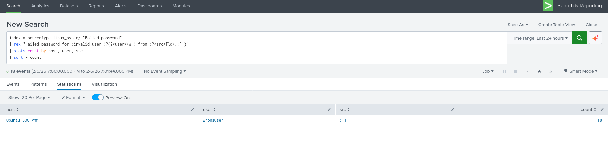
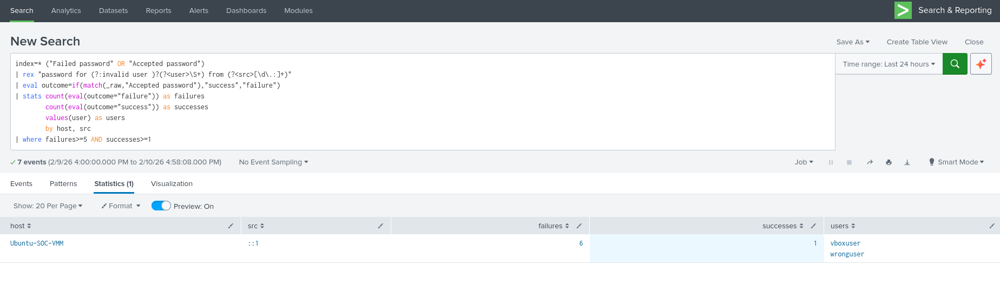
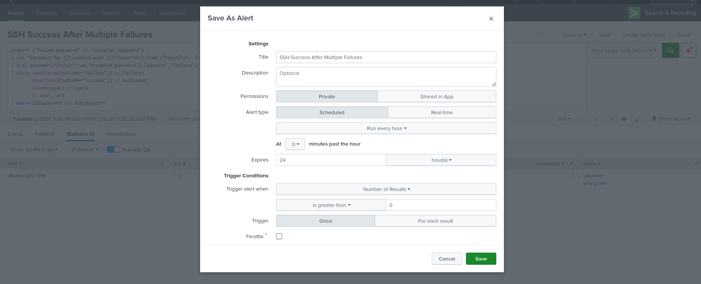

# Splunk SOC Lab: Linux Authentication Monitoring

## Overview
This project demonstrates hands-on SOC analyst skills using Splunk SIEM to monitor and detect suspicious authentication activity on a Linux system.

The lab simulates real-world attack scenarios such as brute-force attacks, successful compromise attempts, and credential spraying.

---

## Lab Environment
- Ubuntu Desktop (Log Source)
- Splunk Enterprise (SIEM)
- VirtualBox Lab Environment

---

## Data Source
- `/var/log/auth.log`
- Sourcetype: `linux_syslog`

---

# Phase 1: SSH Brute-Force Detection

## Objective
Detect multiple failed SSH login attempts indicating brute-force activity.

## SPL Query
index=* sourcetype=linux_syslog "Failed password"
| stats count by host, user, src
| sort - count

## Outcome
- Identified repeated failed login attempts
- Created alert for brute-force detection
- Simulated SOC alert triage

---

# Phase 2: Successful Login After Failures

## Objective
Detect successful login after multiple failed attempts (possible compromise).

## SPL Query
index=* ("Failed password" OR "Accepted password")
| rex "password for (?:invalid user )?(?<user>\S+) from (?<src>[\d.:]+)"
| eval outcome=if(match(_raw,"Accepted password"),"success","failure")
| stats count(eval(outcome="failure")) as failures
count(eval(outcome="success")) as successes
by host, src, user
| where failures>=5 AND successes>=1

## Outcome
- Detected successful login following multiple failures
- Simulated attacker gaining access
- Created alert for high-risk authentication pattern

---

# Phase 3: Multiple Users from Single Source (Credential Spraying)

## Objective
Detect a single source attempting multiple usernames.

## SPL Query
index=* sourcetype=linux_syslog "Failed password"
| rex "Failed password for (invalid user )?(?<user>\S+) from (?<src>[\d.:]+)"
| stats dc(user) as unique_users, count by src
| where unique_users >= 3
| sort - unique_users

## Outcome
- Identified credential spraying behavior
- Detected multiple username attempts from single source
- Simulated attacker reconnaissance activity

---

## Screenshots

### Failed Login Detection

### Success After Failures

### Alert Configuration

---

## Skills Demonstrated
- SIEM configuration and log ingestion
- SPL (Search Processing Language)
- Detection engineering
- Security monitoring and alerting
- Incident investigation and documentation

---

## SOC Analyst Workflow Applied
1. Log ingestion
2. Detection creation
3. Alert configuration
4. Incident investigation
5. Documentation and reporting

---

## Conclusion
This project demonstrates practical SOC analyst capabilities, including detecting brute-force attacks, identifying compromised accounts, and recognizing credential spraying patterns using Splunk.

