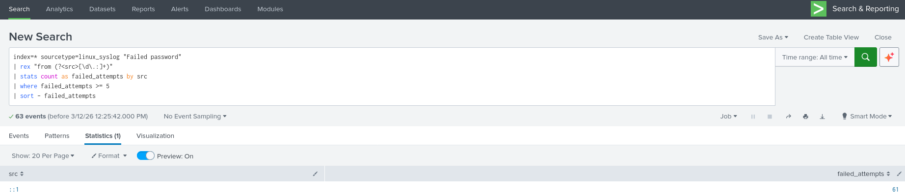
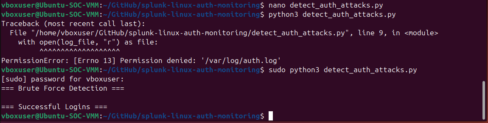
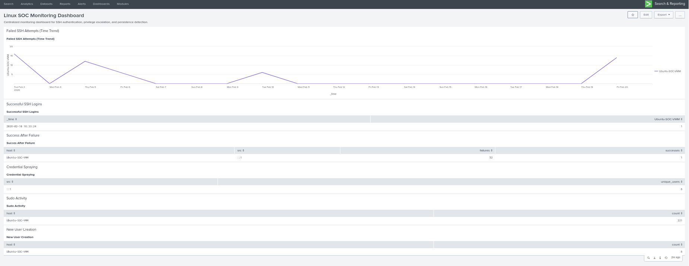
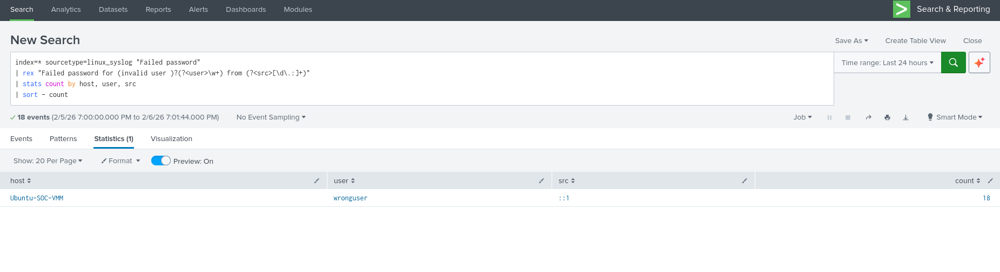
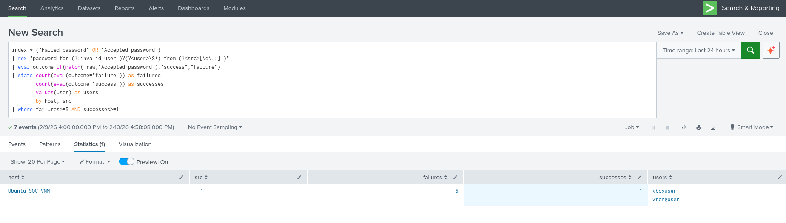
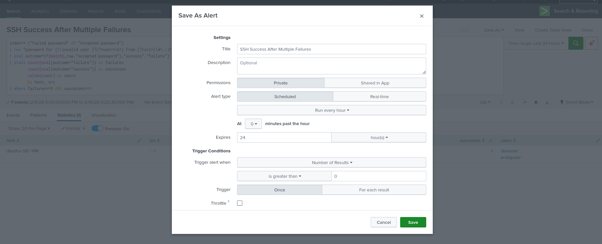
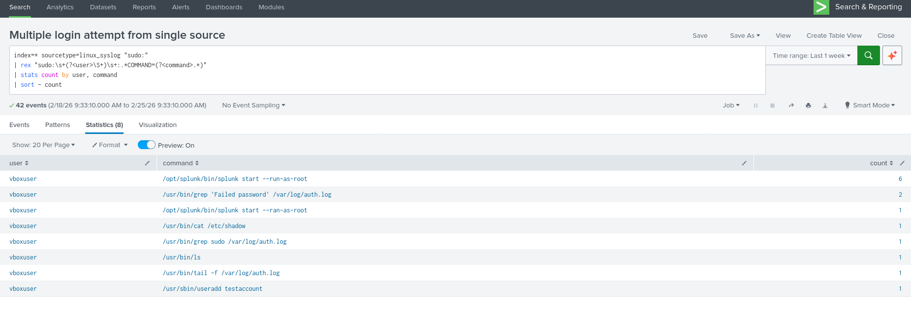
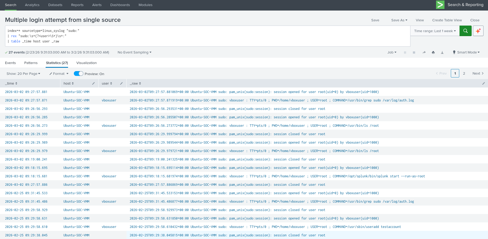
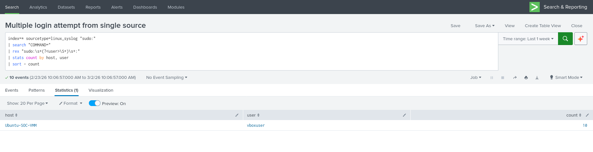
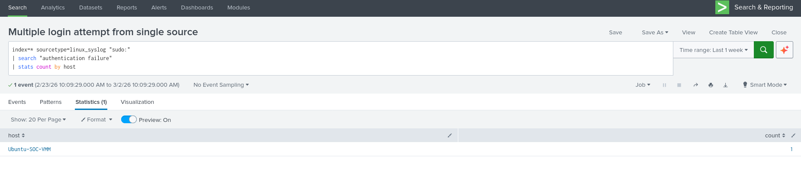

# Splunk SOC Lab: Linux Authentication Monitoring

## Overview
This project demonstrates hands-on SOC analyst skills using Splunk SIEM to monitor and detect suspicious authentication activity on a Linux system.

The lab simulates real-world attack scenarios such as brute-force attacks, successful compromise attempts, and credential spraying.

---

## Lab Environment
- Ubuntu Desktop (Log Source)
- Splunk Enterprise (SIEM)
- VirtualBox Lab Environment

---

## Data Source
- `/var/log/auth.log`
- Sourcetype: `linux_syslog`

---
## Table of Contents

1. [Phase 1-2: SSH Brute Force Detection](#phase-1-2-ssh-brute-force-detection)
2. [Phase 3-4: Failed vs Successful Logins](#phase-3-4-failed-vs-successful-logins)
3. [Phase 5-6: Sudo Activity and Privilege Escalation](#phase-5-6-sudo-activity-and-privilege-escalation)
4. [Phase 7: Persistence Detection (New Users)](#phase-7-persistence-detection-new-users)
5. [Phase 8: Brute Force Detection Alert in Splunk](#phase-8-brute-force-detection-alert-in-splunk)
6. [Phase 9: Terminal-Based Threat Detection](#phase-9-terminal-based-threat-detection)
7. [Phase 10: Python-Based Detection Automation](#phase-10-python-based-detection-automation)
8. [Phase 11: MITRE ATT&CK Mapping](#phase-11-mitre-attck-mapping)

---

## Repository Structure


splunk-linux-auth-monitoring/
├── scripts/ # Python detection scripts
├── screenshots/ # All screenshots of searches, dashboards, alerts, output
├── docs/ # Notes, logs, or supporting files
├── README.md # Project documentation

---

## Key Highlights

- **SIEM Detection**: Built Splunk searches for brute-force and login correlation.
- **Alerting**: Configured Splunk alerts with thresholds for detection.
- **Manual Triage**: Used Linux CLI to monitor logs and detect suspicious activity.
- **Automation**: Python script parses auth.log and outputs alerts automatically.
- **ATT&CK Mapping**: All detections mapped to relevant MITRE ATT&CK techniques.
- **Portfolio Ready**: Screenshots and code demonstrate SOC workflow from detection to alerting.

---

## Skills Demonstrated

- Log ingestion, searching, and alerting (Splunk)
- Linux log analysis and threat detection
- Python scripting for SOC automation
- Incident triage and detection engineering
- SOC workflow documentation
- MITRE ATT&CK alignment

---

## Example Visuals

### Brute Force Detection



### Python Detection Output



### SOC Dashboard Overview



---

## How to Run

1. **Python Script**: Run `scripts/detect_auth_attacks.py` on Linux VM:

```bash
python3 scripts/detect_auth_attacks.py

---

## Manual Log Monitoring: Use commands:

grep "Failed password" /var/log/auth.log
grep "Accepted password" /var/log/auth.log
grep "sudo" /var/log/auth.log

## Outcome

This repository demonstrates real-world SOC workflows: detection, alerting, investigation, automation, and documentation.

---

# Phase 1: SSH Brute-Force Detection

## Objective
Detect multiple failed SSH login attempts indicating brute-force activity.

## SPL Query
index=* sourcetype=linux_syslog "Failed password"
| stats count by host, user, src
| sort - count


## Outcome
- Identified repeated failed login attempts
- Created alert for brute-force detection
- Simulated SOC alert triage

---

# Phase 2: Successful Login After Failures

## Objective
Detect successful login after multiple failed attempts (possible compromise).

## SPL Query
index=* ("Failed password" OR "Accepted password")
| rex "password for (?:invalid user )?(?<user>\S+) from (?<src>[\d.:]+)"
| eval outcome=if(match(_raw,"Accepted password"),"success","failure")
| stats count(eval(outcome="failure")) as failures
count(eval(outcome="success")) as successes
by host, src, user
| where failures>=5 AND successes>=1


## Outcome
- Detected successful login following multiple failures
- Simulated attacker gaining access
- Created alert for high-risk authentication pattern

---

# Phase 3: Multiple Users from Single Source (Credential Spraying)

## Objective
Detect a single source attempting multiple usernames.

## SPL Query
index=* sourcetype=linux_syslog "Failed password"
| rex "Failed password for (invalid user )?(?<user>\S+) from (?<src>[\d.:]+)"
| stats dc(user) as unique_users, count by src
| where unique_users >= 3
| sort - unique_users


## Outcome
- Identified credential spraying behavior
- Detected multiple username attempts from single source
- Simulated attacker reconnaissance activity

---

## Screenshots

### Failed Login Detection


### Success After Failures


### Alert Configuration


---

## Skills Demonstrated
- SIEM configuration and log ingestion
- SPL (Search Processing Language)
- Detection engineering
- Security monitoring and alerting
- Incident investigation and documentation

---

## SOC Analyst Workflow Applied
1. Log ingestion
2. Detection creation
3. Alert configuration
4. Incident investigation
5. Documentation and reporting

---

## Conclusion
This project demonstrates practical SOC analyst capabilities, including detecting brute-force attacks, identifying compromised accounts, and recognizing credential spraying patterns using Splunk.


# Phase 4: Privilege Escalation Detection (sudo Monitoring)

## Objective
Detect post-compromise behavior by monitoring sudo command execution.

## SPL Query
index=* sourcetype=linux_syslog "sudo:"
| sort - count


## Outcome
- Identified users executing privileged commands
- Monitored sensitive actions (user creation, shadow file access)
- Simulated post-compromise escalation scenario

## Investigation Notes
See `investigation_sudo_privilege_escalation.md`


### Screenshot




---

# Phase 5: Privilege Escalation Detection (sudo Monitoring)

## Objective
Detect privilege escalation attempts through sudo usage, including successful and failed authentication attempts.

## Data Source
- `/var/log/auth.log`
- Sourcetype: `linux_syslog`

---

## Detection 1: Successful sudo Command Execution

### SPL Query
index=* sourcetype=linux_syslog "sudo:" "COMMAND="
| rex "sudo:\s+(?<user>\S+)\s+:"
| stats count by host, user
| sort - count


### Purpose
Identifies users executing commands with elevated privileges.

---

## Detection 2: Failed sudo Authentication Attempts

### SPL Query
index=* sourcetype=linux_syslog "sudo:" "authentication failure"
| stats count by host


### Purpose
Detects failed privilege escalation attempts.

---

## Outcome
- Simulated privilege escalation in lab environment
- Verified log ingestion from auth.log
- Created detection queries for sudo monitoring
- Documented SOC investigation workflow

---

## Skills Demonstrated (Phase 5)
- Privilege escalation detection
- Log analysis for command execution
- Field extraction using rex
- Security event correlation
- SOC alert creation and validation

### Field Extraction Example


### Successful sudo Detection


### Failed sudo Detection



# Phase 6: SOC Monitoring Dashboard

A centralized dashboard was built to visualize key Linux authentication and security events in Splunk:

- Failed SSH login attempts
- Successful SSH logins
- Success after multiple failures
- Credential spraying
- Privilege escalation (sudo)
- New user creation

### Dashboard Screenshot


### Outcome
- Created centralized visibility for SOC monitoring
- Monitored brute-force attacks, account compromise, credential spraying, sudo activity, and persistence
- Simulated real SOC operational workflow

---

# Phase 7: SOC Incident Investigation

## Objective
Simulate a full attack chain and investigate the events using Splunk.

The investigation focused on identifying suspicious authentication activity, correlating events, and building a timeline of attacker behavior.

---

## Attack Simulation

The following actions were simulated in the lab environment:

1. Multiple failed SSH login attempts
2. Successful SSH login
3. Privilege escalation using sudo
4. Creation of a new user account

These actions generated security events in `/var/log/auth.log` which were ingested into Splunk.

---

## Investigation Queries

### Failed SSH Logins
index=* sourcetype=linux_syslog "Failed password"

### Successful SSH Logins
index=* sourcetype=linux_syslog "Accepted password"

### Sudo Activity
index=* sourcetype=linux_syslog "sudo:"

### New User Creation
index=* sourcetype=linux_syslog "new user"

---

## Attack Timeline

| Time | Event | Description |
|-----|------|-------------|
| Initial | Failed SSH attempts | Multiple login failures detected |
| Later | Successful login | Account authentication succeeded |
| Next | Sudo command executed | Elevated privileges used |
| Final | New user created | Persistence established |

---

## MITRE ATT&CK Mapping

T1110 – Brute Force  
T1078 – Valid Accounts  
T1068 – Privilege Escalation  
T1136 – Create Account

---

## Outcome

The investigation successfully identified a simulated attack chain including initial access, privilege escalation, and persistence activity.

This demonstrates practical SOC analyst skills including log analysis, event correlation, and incident documentation.


Screenshot 2026-03-09 at 11-44-31 Linux SOC Monitoring Dashboard Splunk 10.2.0.png


## SOC Monitoring Dashboard

The dashboard provides centralized monitoring of authentication activity including brute-force attempts, successful logins, privilege escalation, and persistence events.


---

# Phase 8: Terminal-Based Threat Detection (No SIEM)

## Objective

Perform security monitoring and threat detection directly on a Linux system using command-line tools, without relying on a SIEM platform.

---

## Brute Force Detection
grep "Failed password" /var/log/auth.log


Count failed attempts:
grep "Failed password" /var/log/auth.log | wc -l


Top attacking sources:
grep "Failed password" /var/log/auth.log | awk '{print $(NF-3)}' | sort | uniq -c | sort -nr


---

## Successful Logins
grep "Accepted password" /var/log/auth.log


---

## Privilege Escalation Detection
grep "sudo" /var/log/auth.log


---

## Persistence Detection (New Users)
grep "new user" /var/log/auth.log


---

## Outcome

- Successfully performed threat detection using Linux CLI tools
- Validated authentication logs without SIEM
- Demonstrated incident triage capability in restricted environments

---

## Skills Demonstrated

- Linux log analysis
- Command-line threat detection
- Incident investigation without SIEM
- Security troubleshooting

---

# Phase 9: Python-Based Detection Automation

## Objective

Develop a Python script to automate detection of suspicious authentication activity by analyzing Linux log files.

---

## Script Functionality

The script performs the following:

- Parses `/var/log/auth.log`
- Detects multiple failed login attempts
- Identifies potential brute-force attacks
- Detects successful logins
- Outputs structured alerts

---

## Python Code

```python
# (see detect_auth_attacks.py in repository)

---

## Example Output

## Outcome
Automated detection of brute-force activity
Reduced manual log analysis effort
Demonstrated ability to build security automation tools

## Skills Demonstrated
Python scripting for security
Log parsing and analysis
Detection automation
SOC workflow enhancement
